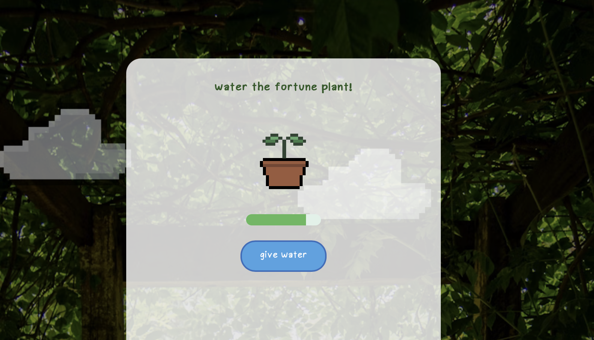

# Fortune Plant

An interactive web application where you can water a seed, watch it grow, and receive a fortune.

  

## About 
This game is a fun spin on fortune cookie, but instead of eating the fortune cookie, you water a plant. I wantted to try something new and learn a bit more animation using CSS and JavaScript

## Try It 
Demo: https://pia-png.github.io/fortune-plant/

## Features
* Simple control
* Animated clouds 
* Shaking plant animation 
* My custom font (made in Hackclub Typeface!!)

## Built With
* HTML
* CSS
* JavaScript 